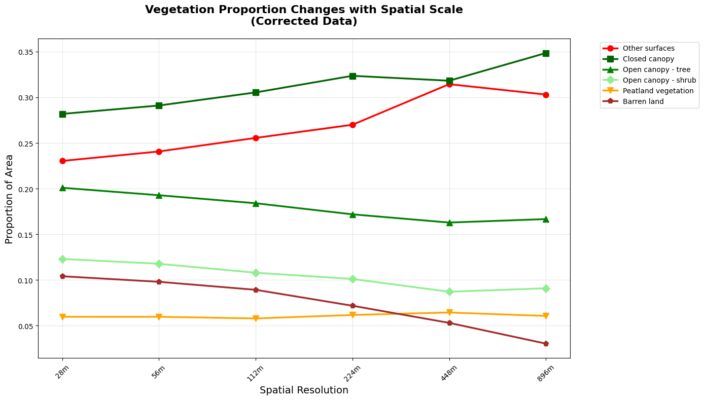
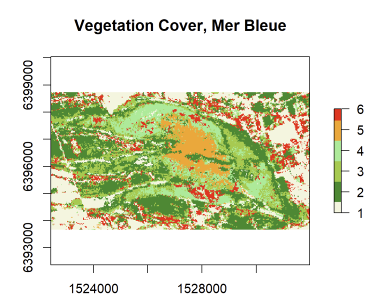
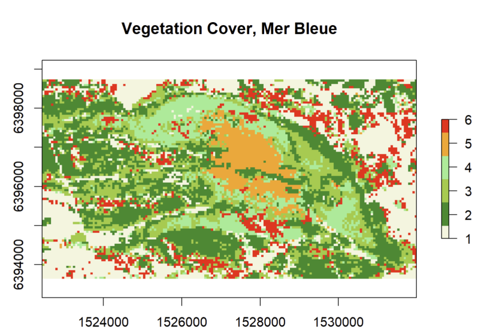
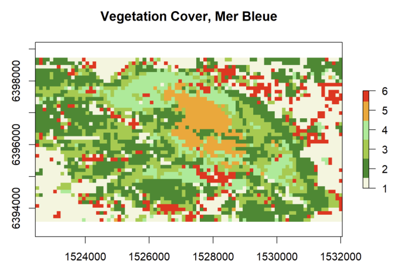
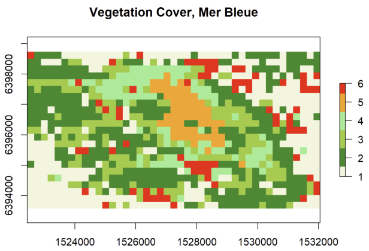
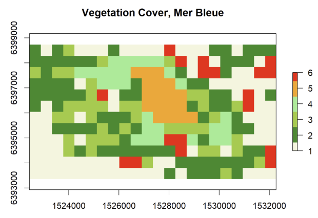
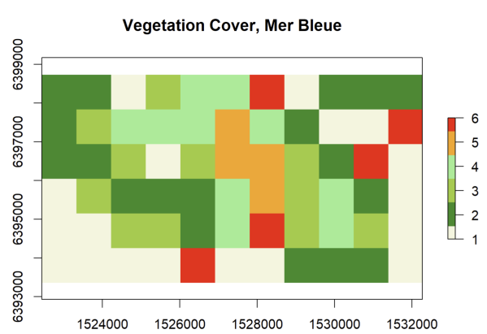
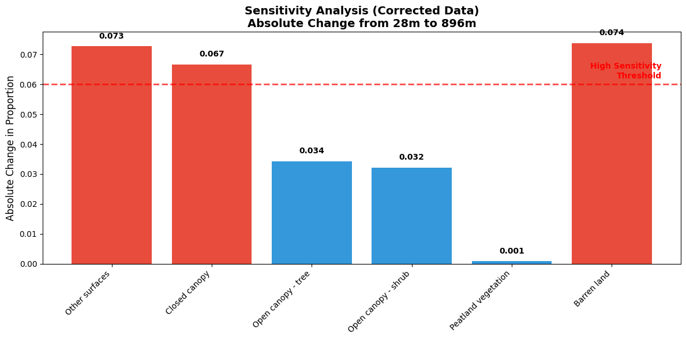
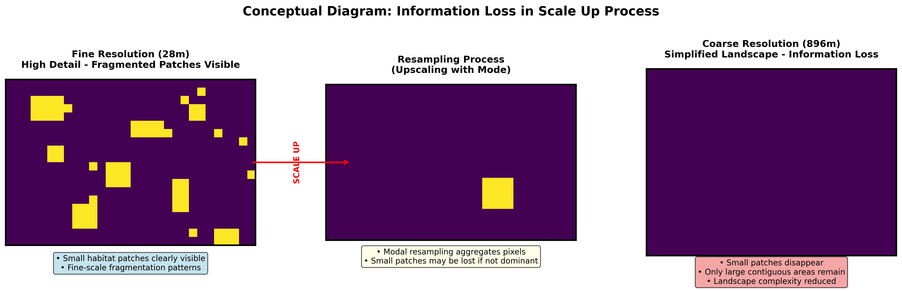

# Scale Effect Analysis on Mer Bleue Vegetation Cover

## Project Overview
This was my assignment for the spatial analysis course, focusing on understanding how changes in spatial resolution (grain size) affect land cover classification results. I analyzed vegetation data from the Mer Bleue peatland in Canada to see how different vegetation types respond when we coarsen the resolution.

## What I Investigated
The main question was: **What happens to our understanding of vegetation patterns when we look at the landscape at different scales?**

I started with high-resolution data (28m) and systematically coarsened it to 56m, 112m, 224m, 448m, and 896m resolutions to see how the proportions of six vegetation classes changed.

## Vegetation Classes
1. **Other surfaces** - Developed areas and other non-vegetated surfaces
2. **Closed tree canopy** - Dense forest cover
3. **Open-tree canopy - tree cover** - Sparse trees
4. **Open-tree canopy - shrub and moss cover** - Low vegetation under open canopy
5. **Peatland vegetation - shrubs and mosses** - Characteristic bog plants
6. **Pseudo-tundra vegetation** - Low-growing tundra-like vegetation

## Methodology

### 1.Data Processing
- Loaded the Mer Bleue vegetation raster using R's `raster` package
- Used `aggregate(mb, factor=2, fun=modal)` to coarsen resolution by factors of 2, 4, 8, 16, and 32
- Calculated area proportions for each vegetation class at each resolution
- Created visualizations to compare patterns across scales

### 2.Key R Skills Used
- Raster data manipulation with `raster` package
- Data frame management and transposition
- Custom plotting with proper axis labeling
- Systematic multi-resolution analysis

## Key Findings

### 1. Scale-Dependent Patterns



- **Barren land and other surfaces** showed the most dramatic changes with scale
- Barren land decreased from ~10% at 28m to ~3% at 896m resolution  
- **Closed canopy forests** remained relatively stable across scales
- **Open canopy areas** showed moderate sensitivity to resolution changes

### 2. Visual Evidence of Scale Effects



| 56m | 112m | 224m |
|:---:|:---:|:---:|
|  |  |  |

| 448m | 896m | 
|:---:|:---:|
|  |  |

### 3. Most Affected Classes  



**Most sensitive**: Barren land and other surfaces (changed by >0.06 in proportion)
**Least sensitive**: Closed canopy and open canopy areas (changed by ~0.03)

### 4. Ecological Interpretation



As Turner et al. (2001) discusses, transferring from fine to coarse grain causes information loss. Small, fragmented habitats like barren patches get "averaged out" when we look at broader scales, while large, continuous features like closed forests remain visible.
## Files Included
- `vegetation_scale_analysis.R` - Complete R script with all analysis steps
- `proportion_plots.png` - Graphs showing how each vegetation type changes with resolution
- `report.pdf` - Formal assignment submission (if applicable)

## How to Run
1. R - `raster` package
2. Use `mbveg2.rst` and `mbveg2.rdc` files in the working directory
3. Run the R script:
```r
source("vegetation_scale_analysis.R")
```
